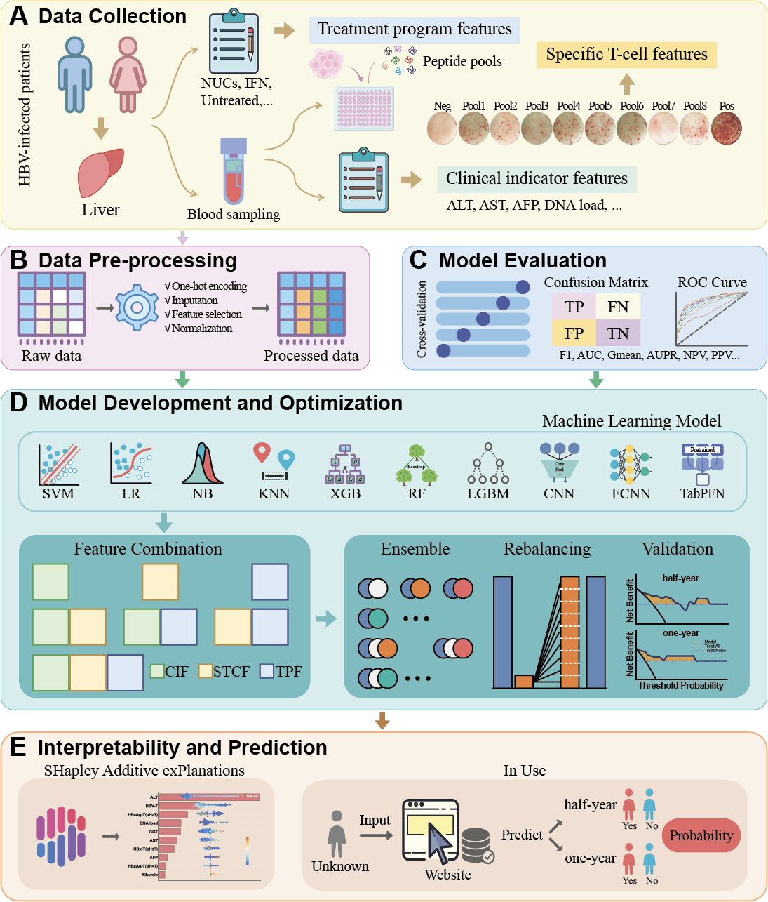

# Hepatitis-Progression-Prediction-ML

This repository contains the code and resources for the research paper titled **"Predicting Short-term Hepatitis activity in HBV-Infected Patients integrated clinical and HBV-specific T cell response: A Comparative and Interpretable Machine Learning Study"**. The study focuses on predicting the progression of hepatitis in HBV-infected patients using a combination of clinical indicators and HBV-specific T cell immune responses. The repository includes the implementation of various machine learning models, feature selection, and ensemble learning techniques to optimize the prediction performance.

## **Comprehensive research framework and analytical pipeline**

## Note

We provide the trained model in the Model folder, as well as a local web deployment script. In addition, there is an online site (https://heppre.online/) for hepatitis progression projections that is free for use by healthcare providers.

The raw data of the study are deposited in the database of the Department of Microbiology and Immunology, Medical School, Southeast University, and can be provided to inquirers upon reasonable requests.
