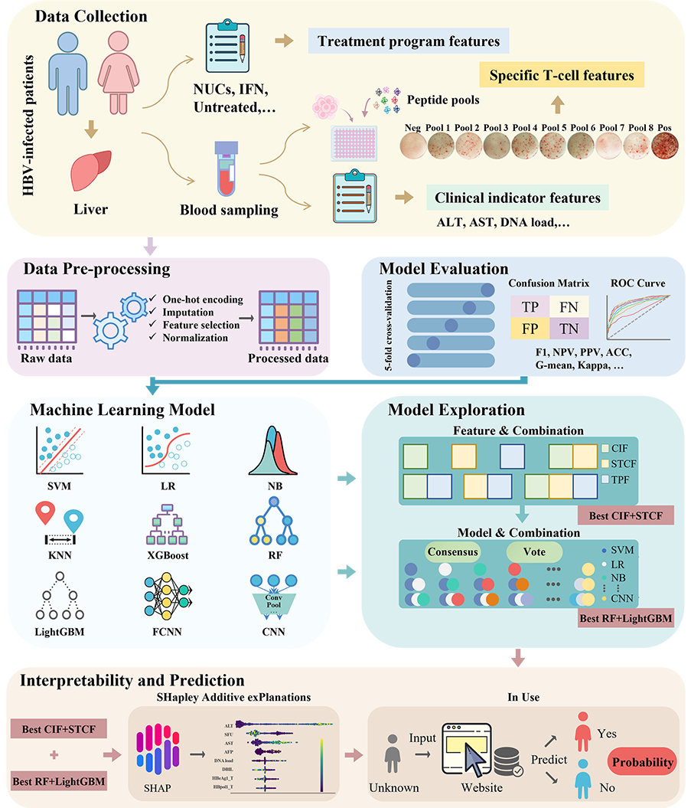

# Hepatitis-Progression-Prediction-ML

This repository contains the code and resources for the research paper titled **"Comparative analysis of multiple machine learning models for hepatitis progression prediction: a cohort study"**. The study focuses on predicting the progression of hepatitis in HBV-infected patients using a combination of clinical indicators and HBV-specific T cell immune responses. The repository includes the implementation of various machine learning models, feature selection, and ensemble learning techniques to optimize the prediction performance.

## **Comprehensive research framework and analytical pipeline**

## Pipeline

1. scripts/preprocess.ipynb:
	Provide a reasonable process of data preprocessing, including basic missing value processing, missing value filling method comparison, feature selection and data normalization.
	
2. scripts/optuna.ipynb:
	Provide machine learning and deep learning methods for hyperparameter tuning, including LR, SVM, KNN, NB, RF, XGBoost, LightGBM, FCNN and CNN.
	
3. scripts/feature_set_comparison.py:
	The model performance under different feature sets and combination of feature sets is compared to select a reasonable feature set.
	
4. scripts/model_combination_comparison.py:
	Comparing the predictive performance of different models and model combinations is used to select the appropriate model combination.
	
5. scripts/shap_model.py:
	Through the SHapley Additive exPlanations (SHAP) analysis, identified critical predictive features, thereby streamlining the feature set while maintaining model accuracy and enhancing interpretability.

### Note

We provide the trained model in the Model folder, as well as a local web deployment script. In addition, there is an online site (https://heppre.icu/) for hepatitis progression projections that is free for use by healthcare providers.

The raw data of the study are deposited in the database of the Department of Microbiology and Immunology, Medical School, Southeast University, and can be provided to inquirers upon reasonable requests.
